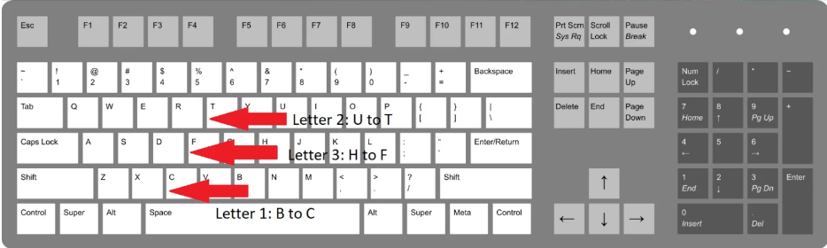

# Reverse Polarity

Use [CyberChef](https://gchq.github.io/CyberChef/) from Binary

Answer

flag :``
CTF{Bit_Flippin}
``

# Morse Code

Use [CyberChef](https://gchq.github.io/CyberChef/) from Morse Code

Answer

flag :``
FLAGSAMUELMORSEISCOOLBYTHEWAYILIKECHEES
``

# Base 2 2 the 6

Use [CyberChef](https://gchq.github.io/CyberChef/) from Base64

Answer

flag :``
CTF{FlaggyWaggyRaggy}
``

# Character Encoding

Use [CyberChef](https://gchq.github.io/CyberChef/) from Hex

Answer

flag :``
ABCTF{45C11_15_U53FUL}
``

# Vigenere Cipher

Use [Cryptii](https://cryptii.com/pipes/vigenere-cipher) with the key : blorpy

Answer

flag :``
flag{CiphersAreAwesome}
``

# BruXOR

Use [Dcode](https://www.dcode.fr/chiffre-xor) XOR

Answer

flag :``
flag{y0u_Have_bruteforce_XOR}
``

# HyperStream Test #2

Use [CyberChef](https://gchq.github.io/CyberChef/) from Bacon Cipher Decode with Standard Alphabet

Answer

flag :``
ILOUEBACONDONTYOU
``

# RSA Noob

Use [Dcode](https://www.dcode.fr/chiffre-rsa) RSA

Answer

flag :``
abctf{b3tter_up_y0ur_e}
``

# Substitution Cipher

Use [Dcode](https://www.dcode.fr/monoalphabetic-substitution) Mono-Alphabetic Substitution Cipher

Answer

flag :``
IFONLYMODERNCRYPTOWASLIKETHIS
``

# Substitution Cipher

``python
print(hex(0xc4115 ^ 0x4cf8))
``

Answer

flag :``
0xc0ded
``

# Modern Gaius Julius Caesar 

The hint given by the title is Julius Ceaser, which is a rotatory cipher. The next hint is the keyboard. Yes, the challenge only works for the US keyboard. As you guessed, the first three letters should be ‘CTF’ where we have : B -> C, U -> T, H -> F

Answer

flag :``
CTFlearn{Cyb3r_Cae54r}
``

# Modern Gaius Julius Caesar 

Use [Dcode](https://www.dcode.fr/polybius-cipher) Polybius Cipher with the alphabet encryption grid excluding the letter k

Answer

flag :``
CTF{THUMBS_UP}
``

# Suspecious message

Use [Playfair Cipher](https://www.boxentriq.com/code-breaking/playfair-cipher) to decode with the encryption key in the image png

Answer

flag :``
CTFLEARN{PL4YF41R_1S_C00L_C1PHERRRR}
``

# So many 64s

Use [python scripts](https://github.com/GuillaumeDupuy/CTF/blob/main/CTFLearn/scripts/64s.py) for recover flag

Answer

flag :``
ABCTF{pr3tty_b4s1c_r1ght?}
``

# RSA Beginner

Use [Dcode](https://www.dcode.fr/chiffre-rsa) RSA

Answer

flag :``
abctf{rs4_is_aw3s0m3}
``

# RSA Twins!

Use [Dcode](https://www.dcode.fr/chiffre-rsa) RSA

Answer

flag :``
flag{i_l0v3_tw1N_pr1m3s}
``

# CoppeRSA Lattice

Use [Dcode](https://www.dcode.fr/chiffre-rsa) RSA

Answer

flag :``
CTFlearn{n0t_th4t_s3cur3_4ft3r_4ll}
``

# Encryption Master 

Just use fourth time [Cyberchef](https://gchq.github.io/CyberChef/) from Base64 from Hex from Binary from base64

Answer

flag :``
CTF{I_AM_PROUD_OF_YOU}
``

# Tone dialing

Answer

flag :``
CTFlean{CRYPTOGRAPHY}
``

# ALEXCTF CR2: Many time secrets

Use [python scripts](https://github.com/GuillaumeDupuy/CTF/blob/main/CTFLearn/scripts/cribdrag.py)

We know that part of the key is ALEXCTF{ is a good start. We will get a lot of possibilities for plain text , We need to make a calculate guess of the each line. After a little work we can get the full key that reused again and again.

Answer

flag :``
ALEXCTF{HERE_GOES_THE_KEY}
``

