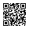

# Forensics 101

Use ``strings``

<details>
<summary markdown="span">Answer</summary>

flag :``
flag{wow!_data_is_cool}
``
</details>

# Taking LS

Cat the file ``ThePassword.txt`` to recover the password of pdf file 

<details>
<summary markdown="span">Answer</summary>

flag :``
ABCTF{T3Rm1n4l_is_C00l}
``
</details>

# Binwalk

Use `binwalk` extract to recover the png file with the file

<details>
<summary markdown="span">Answer</summary>

flag :``
ABCTF{b1nw4lk_is_us3ful}
``
</details>

# WOW.... So Meta

Use `exiftool ` the file

<details>
<summary markdown="span">Answer</summary>

flag :``
flag{EEe_x_I_FFf}
``
</details>

# 07601

Use `strings` the file

<details>
<summary markdown="span">Answer</summary>

flag :``
ABCTF{Du$t1nS_D0jo}
``
</details>

# Git Is Good

Use git command

``sh
git log -p
``

<details>
<summary markdown="span">Answer</summary>

flag :``
flag{protect_your_git}
``
</details>

# Exif

Use `exiftool` the file

<details>
<summary markdown="span">Answer</summary>

flag :``
flag{3l1t3_3x1f_4uth0r1ty_dud3br0}
``
</details>

# Rubber Duck

Use `exiftool` the file

<details>
<summary markdown="span">Answer</summary>

flag :``
CTFlearn{ILoveJakarta}
``
</details>

# Snowboard

Use ``strings`` file, select the strings in base64 and convert into string

<details>
<summary markdown="span">Answer</summary>

flag :``
CTFlearn{SkiBanff}
``
</details>

# PikesPeak

Use ``strings`` and test all flag

<details>
<summary markdown="span">Answer</summary>

flag :``
CTFlearn{Gandalf}
``
</details>

# I'm a dump

Use ``strings`` file

<details>
<summary markdown="span">Answer</summary>

flag :``
CTFlearn{fl4ggyfl4g}
``
</details>

# Chalkboard

Use ``strings``, recover the flag and calculate x and y and replace

<details>
<summary markdown="span">Answer</summary>

flag :``
CTFlearn{I_Like_Math_2_5}
``
</details>

# Tux!

Use ``strings`` file, select the strings in base64 and convert into string. You have a password
Use `binwalk` to extract and use the password for open the file of the flag

<details>
<summary markdown="span">Answer</summary>

flag :``
CTFlearn{Linux_Is_Awesome}
``
</details>

# A CAPture of a Flag 

Use wireshark

<details>
<summary markdown="span">Answer</summary>

flag :``
flag{AFlaginPCAP}
``
</details>

# Milk's Best Friend

Use `binwalk` to extract png file and use ``strings`` on the png extracted

<details>
<summary markdown="span">Answer</summary>

flag :``
flag{eat_more_oreos}
``
</details>

# Up For A Little Challenge?

Use ``strings`` and click on the link, download the file, ls th folder and zip the secret file. Use the password on the first string to open the jpg and check on the bottom right on the image

<details>
<summary markdown="span">Answer</summary>

flag :``
flag{hack_complete}
``
</details>

# Digital Camouflage

Use wireshark

<details>
<summary markdown="span">Answer</summary>

flag :``
PApdsjRTae
``
</details>

# Naughty Cat

Use `binwalk` to extract the rar and mp3 file. Open the rar with [Hexed](https://hexed.it/) to repair the error file and replace the signature file. Now use Audacity and select spectogramme to see the password of the txt file in the rar. Recover the encoded string in base64 and convert to recover the flag

<details>
<summary markdown="span">Answer</summary>

flag :``
f0r3n51cs_ma5t3r
``
</details>

# MountainMan

Use [Hexed](https://hexed.it/), search ``ff d9``, copy the hex between the two delimeter and use [Cyberchef](https://gchq.github.io/CyberChef/) from Hex and Magic to recover the flag by XOR

<details>
<summary markdown="span">Answer</summary>

flag :``
CTF{Ubuntu_r0ck5}
``
</details>

# Corrupted File

Use [Hexed](https://hexed.it/), replace the signature file by the signature of GIF file : ``47 49 46 38``
Recover the fragment of encode string in base64 : ``ZmxhZ3tnMWZfb3JfajFmfQ==`` and convert

You can use the command to convert each frame of the gif to png, to see properly each fragment

``sh
convert -coalesce unopenable.gif target.png
``

<details>
<summary markdown="span">Answer</summary>

flag :``
flag{glf_or_jlf}
``
</details>

# Pho Is Tasty!

Use hex editor to analyse the image [Hexed](https://hexed.it/) and copy the hex code till the flag we can see on the side. Convert hex into ascii. Remove the ``.`` in between from the converted string and we will have our flag.

<details>
<summary markdown="span">Answer</summary>

flag :``
CTFlearn{I_Love_Pho!!!}
``
</details>

# Simple Steganography

Use ``strings`` in the file, recover the password. Use ``steghide`` to extract the file

``sh
steghide extract -sf Minions1.jpeg -p myadmin
``

Recover the strings and decode by base64

<details>
<summary markdown="span">Answer</summary>

flag :``
CTFlearn{this_is_fun}
``
</details>

# Minions 

Use ``strings`` in the file, click on the link, download the new image. Use `binwalk` to extract the image. 

``sh
strings YouWon\(Almost\).jpg | grep -i "CTF"
``

Recover the flag encoded in base64, use [CyberChef](https://gchq.github.io/CyberChef/) fourth time and you have the flag

<details>
<summary markdown="span">Answer</summary>

flag :``
CTFlearn{M1NI0NS_ARE_C00L}
``
</details>

# PDF by fdpumyp 

Use ``strings`` in the file. Recover the flag encoded in base64, use [CyberChef](https://gchq.github.io/CyberChef/) from Base64

<details>
<summary markdown="span">Answer</summary>

flag :``
CTFlearn{M1NI0NS_ARE_C00L}
``
</details>

# GandalfTheWise

Use ``exiftool``, recover the comments encoded in the base64, use [CyberChef](https://gchq.github.io/CyberChef/). If you try to submit the flag, it will not accept but it does give us a hint : XOR.

So for that we still have 2 more comments. If you will decode the two base64 string we will get some unicode text so we now know we have to use that decoded strings and perform XOR on that strings. Use [python scripts](https://github.com/GuillaumeDupuy/CTF/blob/main/CTFLearn/scripts/gandalf.py)

<details>
<summary markdown="span">Answer</summary>

flag :``
CTFlearn{Gandalf.BilboBaggins}
``
</details>

# Blank Page

The txt is empty, if you check the file in [Hexed](https://hexed.it/), you see the txt file contains only `.`and `[space]`. Maybe is morse code but not because the morse code is `.`and `-`, so it binary where . represents 1 and [space] represents 0.

Use [python scripts](https://github.com/GuillaumeDupuy/CTF/blob/main/CTFLearn/scripts/binary.py)

Recover the binary and use [CyberChef](https://gchq.github.io/CyberChef/) from Binary

<details>
<summary markdown="span">Answer</summary>

flag :``
CTFlearn{If_y0u_r3/\d_thi5_you_pa553d}
``
</details>

# abandoned place

Use `exiftool`, you see `Image Width`and the `Image Height`. Convert the decimal in hex, so now we will try to make the image same dimensions. Use [Hexed](https://hexed.it/), search `03 84`and replace by `07 E0` and save the file. Now open the file and you see the flag

<details>
<summary markdown="span">Answer</summary>

flag :``
CTFlearn{urban_exploration}
``
</details>

# The adventures of Boris Ivanov. Part 1

Use `stegslove`, one of his option is Stereogram Solver and in this option there are 1000 offsets possible. You found the flag in offset 898.

<details>
<summary markdown="span">Answer</summary>

flag :``
flag{d0nt_m3s5_w1th_th3_KGB}
``
</details>

# HailCaesar

Use [python scripts](https://github.com/GuillaumeDupuy/CTF/blob/main/CTFLearn/scripts/asciicipher.py)

<details>
<summary markdown="span">Answer</summary>

flag :``
CTFlearn{Maximus.Decimus.Meridius}
``
</details>

# Seeing is believing

Use Audacity and select spectogramme to see the QRCode, scan

<details>
<summary markdown="span">Answer</summary>

flag :``
the_flag_is{A_sP3c7r0grAm?!}
``
</details>

# Smiling ASCII

Use `zsteg` to the file

```sh
zsteg --all smiling.png
```

<details>
<summary markdown="span">Answer</summary>

flag :``
CTFlearn{ascii_pixel_flag}
``
</details>

# The Keymaker

Fire `file The-Keymaker.jpg` in the terminal.
So we can see there are two base64 strings in the comments. So we will decode that one by one with [CyberChef](https://gchq.github.io/CyberChef/).

So we found the string `openssl enc -d -aes-256-cbc -iv SOF0 -K SOS -in flag.enc`. So we now know that we need three things to decode flag

```
SOF0 (Start Of Frame) key,
SOS (Start Of Scan) key and
flag.enc file
```
Don't worry we will come to the point what is SOS and SOF0, first let us see what the second base64 string gives us.

So we can see that it gives a Unicode Text. So this makes us understand this is our flag to be decoded so it is our `flag.enc` so we will store the contents in flag.enc.

Fire `echo mmtaSHhAsK9pLMepyFDl37UTXQT0CMltZk7+4Kaa1svo5vqb6JuczUqQGFJYiycY | base64 -d > flag.enc` in the terminal.

Now we need `SOS key` and `SOF0 key`. First We will find out where is the starting of SOS & SOF0 Key.

For SOS
```
SOS
  start of scan
  0xFF 0xDA
  Complicated. See below for details.
```

So we know SOS starts as ``0xFF 0xDA``. So we will open the The-Keymaker.jpg in hex editor like [Hexed](https://hexed.it/) and select 32 bits after the start of SOS as the size of SOS is 32 bits. Press Ctrl+f to find and search ``FF DA`` and copy 32 bits excluding ``FF DA``.

Paste the 32 bits strings in any text editor and remove the spaces between them the resultant string would be:
``000C03010002110311003F00F9766BFC44BEDA8F3F5C031B92CB0E92D6BDC952``

Now we have to do the same with SOF0.

For SOF0
```
SOF0 	
  start of frame (baseline DCT)
  0xFF 0xC0
  Variable size. Typically 0x00 0x11 (17 bytes) for images with 3 components (e.g., YCrCb).
```

Now we know SOF0 starts as 0xFF 0xC0. Repeat the same and find for ``FF C0`` and copy the string till the next ``FF`` including ``FF C0`` and paste it in any text editor and remove ``FF C0 00 11`` from the pasted string as it defines the size of SOF0.

The resultant string would be:
``0800BE00C803011100021101031101FF``

Now we have got all the things to decode our flag.enc. Now we will prepare the decoding statement by combining the keys.
Fire this command in terminal :

```sh
openssl enc -d -aes-256-cbc -iv 0800BE00C803011100021101031101FF -K 000C03010002110311003F00F9766BFC44BEDA8F3F5C031B92CB0E92D6BDC952 -in flag.enc > flag.txt
```

Now we will see the content of flag.txt using cat.

<details>
<summary markdown="span">Answer</summary>

flag :``
CTFlearn{Ne0.TheMatrix}
``
</details>

# Exclusive Santa

Use `binwalk` extract on the two image file. On the 3.pn, you have a another image

So now use `stegsolve` to combine the image 3.png with the image extracted

<details>
<summary markdown="span">Answer</summary>

flag :``
CTFlearn{Santa_1s_C0ming}
``
</details>

# Dumpster

So we have two files:

- Decryptor.java.
- Heapdump.hprof - The heap dump of the Decryptor.

By looking on the Decrypt file we can see the encrypted flag stored in the variable FLAG.

#### How to decrypt the flag ???
We need to write some pass that will be encrypted with SHA-256, And the first 16 bytes will stored in variable **passHash**.

The variable passHash would be the key in the AES decryption of FLAG after that.

Ok, After we understood all the process , we only have one missing piece in the puzzle - how we get the **pass** !? The answer is the second file - **Heapdump.hpro**

#### Heap dump memory analyzer
The second file is a dump of the heap from the program as you can notice here:

So we need to analyze the dump to catch where the user input the pass.
We will use the program visualvm. Before we start i recommend to you to explore the dump by yourself and do a full analyze and exploring for good understanding.

#### Analyze
After analyze all the dump i have notice a problem to find the pass... But i find the passHash !!! By going to the main thread -> Decryptor$Password -> **passHash**

Now that we have the passHash we can wirte a short program that would be decrypt the flag.

You can find the [java scripts](https://github.com/GuillaumeDupuy/CTF/blob/main/CTFLearn/scripts/dumpster.java)

<details>
<summary markdown="span">Answer</summary>

flag :``
stCTF{h34p_6ump5_r_c00l!11!!}
``
</details>

# Mr.Bin

Use [pyhton scripts](https://github.com/GuillaumeDupuy/CTF/blob/main/CTFLearn/scripts/convert.py)

<details>
<summary markdown="span">Answer</summary>

flag :``
CTFlearn{y0u_n4il3d_it}
``
</details>

# Jakarta

Use [pyhton scripts](https://github.com/GuillaumeDupuy/CTF/blob/main/CTFLearn/scripts/jakarta.py) and [CyberChef](https://gchq.github.io/CyberChef/) RSA Decrypt

<details>
<summary markdown="span">Answer</summary>

flag :``
CTFlearn{Jakarta_Ind0nes1a}
``
</details>

# Music To My Ears

[Step for fix a corrupted file voice](http://sysfrontier.com/en/2014/12/31/hello-world/)

<details>
<summary markdown="span">Answer</summary>

flag :``
flag{1_c4n_f1x_it}
``
</details>

# Brute Force is Fun!

Use [pyhton scripts](https://github.com/GuillaumeDupuy/CTF/blob/main/CTFLearn/scripts/brutepass.py) for recover the password of zip file : `ctflag48625`

Unzip the `flag.zip` and `cat flag.txt | base64 -d` with decode base64

<details>
<summary markdown="span">Answer</summary>

flag :``
FLAG{may_the_brute_force_be_with_you}
``
</details>

# Bobby Toe's iPad

Check with `stegsolve` or `zsteg` in red plane mode 0, there is ciphertext

After parsing with zsteg, it turns out that there are JPGs inside the PNGs, the JPGs are not detected by the avant and binwalk tools because the file contains an incorrect/incomplete header, add en headers to file. Use [Hexed](https://hexed.it/) to repair the error file and replace the signature file

Use `foremost ` for extract the jpg file

Decrypt obtained cipher text with stegsolve and key on vigenere cipher on [Cryptii](https://cryptii.com/) from Vigenere Cipher with encryptext : `zpv_tigqylhbafmeoesllpms` and key : `bbbabydonthurtmewhatislove`

<details>
<summary markdown="span">Answer</summary>

flag :``
you_thinkyougotskillshuh
``
</details>

# QR-code inception

If you pay attention to the middle of the black or white pixels, there is also a QR-Code Encode containing 1 string

But here I solved it manually which took a long time using Android QR code reader and then I got the string : `iVBORw0KGgoAAAANSUhEUgAAACUAAAAlAQAAAADt5R2uAAAAsUlEQVR4nGP4DwQ/GDDJD9IGDhUM369x3q9g+BJgdBFIRvQEAsnwKUD290uzgOIfREOBav5/jgSq/3T2sQtQb865mgqGn46fGn4wfLE/eqaC4VN/1jkgmVFdBdR7sripguGPMrfeD4ZvUhO1fjD8+P73JlAl58YDQPEfGxf/YPjuFcQINPOLSRHQDULCQUCRG6olQL0xh9lBLpkXAVQfM6sU6IYrr78B1Yga2mFzP5gEAB2SgeETXS+JAAAAAElFTkSuQmCC`

Turns out the base64 encoding, if decoded it's a small PNG, decodes the string as a file and the resul



<details>
<summary markdown="span">Answer</summary>

flag :``
CTFlearn{Y0u_4re_in_QR-cOd3_l1mb0}
``
</details>

# ShahOfGimli

Look at the comments file with `Exiftool`, there are many base64 encodings and check them one by one

There is a hint in the form of a key it's sha256(CTFlearn) and related to AES_CBC, so for the 3rd comment if it's decoded it's encryption. Now let's try to decrypt the message

Use [pyhton scripts](https://github.com/GuillaumeDupuy/CTF/blob/main/CTFLearn/scripts/shah.py)

Use `binwalk` twice for extract the png file 

Among the 3 flags obtained above there is a clue, namely the key is sha256 (Gimli file) and also in the JPG file there is still a flag.enc file which is still AES_CBC encrypted

Decrypt the flag.enc file in the same way as the previous decryption method and decode the base64 encryption file first

``sh 
cat flag.enc | base64
``

``sh
sha256sum Gimli04Base.jpg 
``

Use [pyhton scripts](https://github.com/GuillaumeDupuy/CTF/blob/main/CTFLearn/scripts/shah2.py)

<details>
<summary markdown="span">Answer</summary>

flag :``
CTFlearn{Gimli.Is.A.Warrior}
``
</details>

# The Data Scientist

Use [pyhton scripts](https://github.com/GuillaumeDupuy/CTF/blob/main/CTFLearn/scripts/data.py)

You receive a hint, so we will replace all values ​​between 64 and 65 with black. And you obtained a QRcode so you will use an [4qrcode](https://4qrcode.com/scan-qr-code.php) or with the script below

Use [pyhton scripts](https://github.com/GuillaumeDupuy/CTF/blob/main/CTFLearn/scripts/qrcode.py)

<details>
<summary markdown="span">Answer</summary>

flag :``
CTFlearn{m4ch1n3_l34rn1n9_rul35}
``
</details>

# Noise?

Analyze image files with the `zsteg` tool.

We can see that there is a 250x287 PNG file on red LSB. Extract the file with the `stegsolve` tool as shown below and save it

Then repeat the first step (`zsteg`) on the image you just got and continue up to 13 times, then the flag is in the last file

<details>
<summary markdown="span">Answer</summary>

flag :``
flag{n0t_n0ise_4ft3r_4ll}
``
</details>

# Phone

Use [pyhton scripts](https://github.com/GuillaumeDupuy/CTF/blob/main/CTFLearn/scripts/phone.py) and scan the QR Code output

<details>
<summary markdown="span">Answer</summary>

flag :``
CTFlearn{DTMF_1s_y0ur_fr13nd}
``
</details>