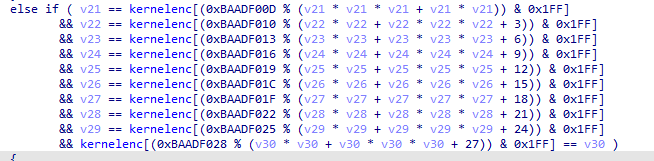
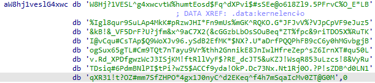

# Solution

Reading the Decompile code, the inner part of CTFlearn{} will be checked like this:

where kernelenc is the long string:

Use [python scripts](https://github.com/GuillaumeDupuy/CTF/blob/main/CTFLearn/scripts/rzeszow.py)