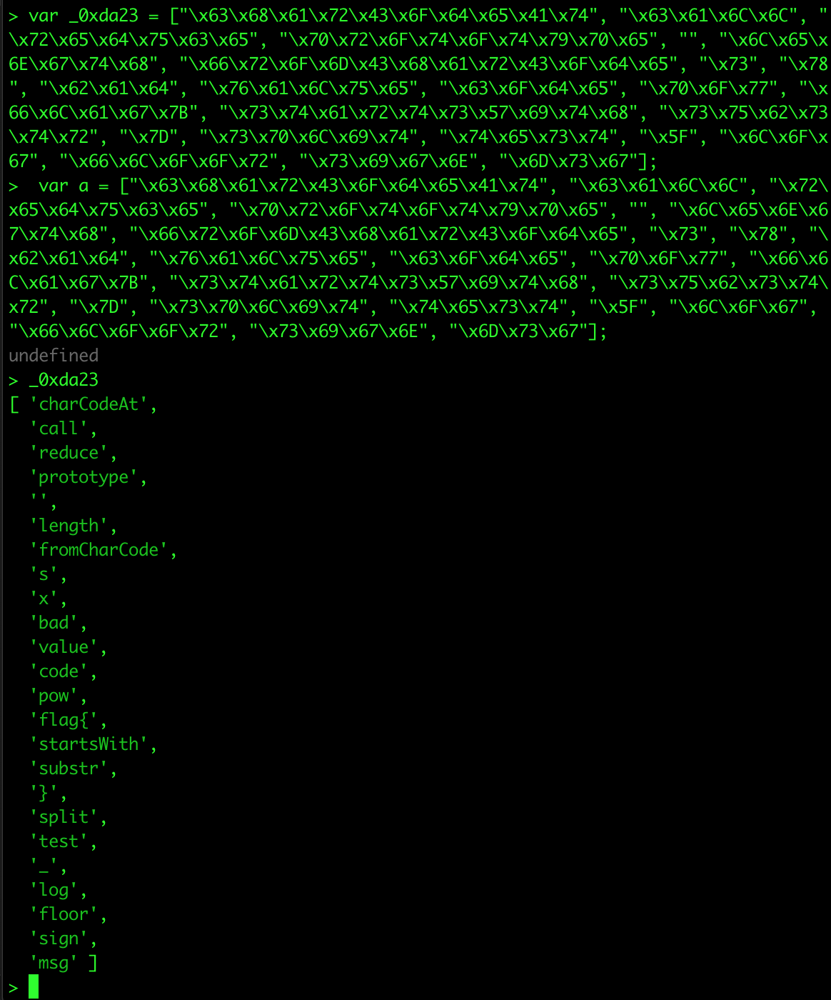
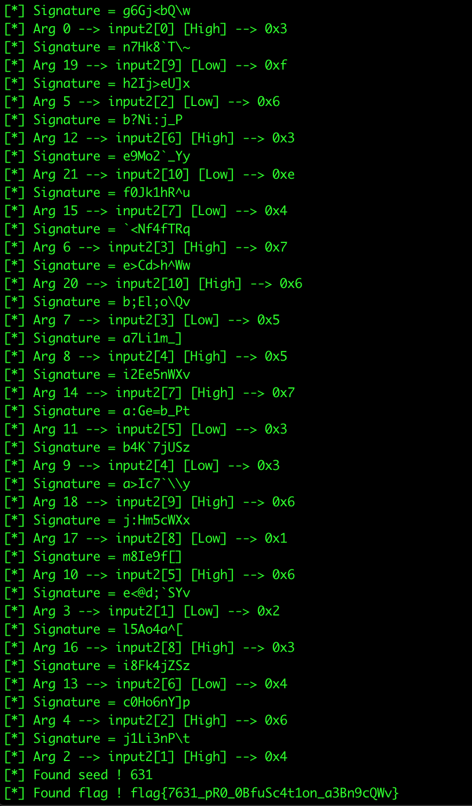

# Solution

Our goal is to find password that matches message and signature provided in the header. Password is checked by client-side in script check.js.

```
msg = ["You fail!", "Seriously?", "Ha! Ha! You wish it was right!", "Correct! (jkjk its wrong lol)", "stap tryin! youll nvr git it right!", "<code>throw 'you tried'; //throwing something you can catch!</code>", "just give up!", "y0u n00b! R U just bru13 f0rc1ng?"]
tries = 0;
function check()
{
    try
    {
        $ = document.getElementById.bind(document);
        j = window.d0cument;
        check2();

        $("resp").innerText = "Correct! (Oh gosh! I guess you've done it...)";
        $("resp").className = "good";
    }
    catch (e)
    {
        if (tries >= msg.length)
            tries = 0;
        $("resp").innerHTML = msg[tries];
        $("resp").className = "error";
        tries++;
    }
}

function check2()
{
    //Randomizer taken from https://stackoverflow.com/a/19301306/7344257 code
    var m_w = 123456789;
    var m_z = 987654321;
    var mask = 0xffffffff;

    // Takes any integer
    function seed(i) 
    {
        m_w = i;
    }

    function random()
    {
        m_z = (36969 * (m_z & 65535) + (m_z >> 16)) & mask;
        m_w = (18000 * (m_w & 65535) + (m_w >> 16)) & mask;
        var result = ((m_z << 16) + m_w) & mask;
        return result
    }

    //Ignore this code... This is the magical part of this verifier
    var _0xda23 = ["\x63\x68\x61\x72\x43\x6F\x64\x65\x41\x74", "\x63\x61\x6C\x6C", "\x72\x65\x64\x75\x63\x65", "\x70\x72\x6F\x74\x6F\x74\x79\x70\x65", "", "\x6C\x65\x6E\x67\x74\x68", "\x66\x72\x6F\x6D\x43\x68\x61\x72\x43\x6F\x64\x65", "\x73", "\x78", "\x62\x61\x64", "\x76\x61\x6C\x75\x65", "\x63\x6F\x64\x65", "\x70\x6F\x77", "\x66\x6C\x61\x67\x7B", "\x73\x74\x61\x72\x74\x73\x57\x69\x74\x68", "\x73\x75\x62\x73\x74\x72", "\x7D", "\x73\x70\x6C\x69\x74", "\x74\x65\x73\x74", "\x5F", "\x6C\x6F\x67", "\x66\x6C\x6F\x6F\x72", "\x73\x69\x67\x6E", "\x6D\x73\x67"];
    function hash(_0x7a95x2) {
        var _0x7a95x3 = 0xffffffff;
        return Array[_0xda23[3]][_0xda23[2]][_0xda23[1]](_0x7a95x2, function(a, b) {
            return (a * 31 + b[_0xda23[0]](0)) & _0x7a95x3
        }, 0)
    }
    function xor(_0x7a95x7, _0x7a95x8) {
        var z = _0xda23[4];
        for (var i = 0; i < _0x7a95x7[_0xda23[5]]; i++) {
            z += String[_0xda23[6]](_0x7a95x7[_0xda23[0]](i) ^ _0x7a95x8)
        }
        ;
        return z
    }
    function xor2(_0x7a95x7, _0x7a95x8) {
        var z = _0xda23[4];
        for (var i = 0; i < _0x7a95x7[_0xda23[5]]; i++) {
            z += String[_0xda23[6]](_0x7a95x7[_0xda23[0]](i) ^ (_0x7a95x8[_0xda23[0]](i % _0x7a95x8[_0xda23[5]]) & 15))
        }
        ;
        return z
    }
    function decode(_0x7a95xd, _0x7a95xe, _0x7a95xf) {
        x = _0x7a95xf % 2;
        y = _0x7a95xe[_0xda23[0]]((_0x7a95xf - x) / 2);
        if (!x) {
            y >>= 4
        }
        ;
        y &= 0xf;
        return xor(_0x7a95xd, y)
    }
    function runcode(_0x7a95x11, _0x7a95xd, _0x7a95xe) {
        _0x7a95xd = decode(_0x7a95xd, _0x7a95xe, 0);
        try {
            var _0x7a95x12 = {
                x: _0x7a95xd,
                d: decode,
                k: _0x7a95xe,
                o: xor2,
                s: _0x7a95x11
            };
            var _0x7a95xf = 0;
            for (var i = 0; i < _0x7a95xe[_0xda23[5]] * 2; i++) {
                new Function(_0xda23[7], _0x7a95x12[_0xda23[8]])(_0x7a95x12)
            }
            ;
            return _0x7a95x12[_0xda23[7]]
        } catch (e) {
            throw _0xda23[9]
        }
    }
    seed(18458);
    j++;
    input = $(_0xda23[11])[_0xda23[10]];
    var a,b,c,d,e,f,g,h,i,j,k,l,m,n,o,p,q,r,s,t,u,v,w,x,y,z;
    a = 1;
    TRUE = (j == j);
    FALSE = !TRUE;
    b = Math[_0xda23[12]](++a, a + ++a + TRUE) - FALSE + TRUE;
    c = Math[_0xda23[12]](a++ - FALSE, a += FALSE + FALSE) - FALSE;
    d = (random() + random()) & b;
    if (!input[_0xda23[14]](_0xda23[13]) || input[_0xda23[15]](-FALSE) != _0xda23[16] || hash(input) != -1996285287 || input[_0xda23[5]] != (random() & c)) {
        throw _0xda23[9]
    }
    ;
    f = random() & b - d;
    input = input[_0xda23[15]](a)[_0xda23[17]](_0xda23[16])[+TRUE];
    if (!/^[A-Za-z0-9_]+$/[_0xda23[18]](input)) {
        throw _0xda23[9]
    }
    ;
    f *= f;
    input = input[_0xda23[17]](_0xda23[19]);
    if (input[_0xda23[5]] != f || input[+FALSE][_0xda23[5]] != f - FALSE - TRUE || input[+FALSE][+FALSE] != 'R') {
        throw _0xda23[9]
    }
    ;
    try {
        seed(parseInt(input[TRUE + TRUE]));
        g = ~random() ^ hash(input[FALSE + FALSE]) ^ hash(input[f - FALSE + TRUE]);
        console[_0xda23[20]](g);
        if (g != 1865600952) {
            throw _0xda23[9]
        }
    } catch (e) {
        throw _0xda23[9]
    }
    ;
    seed(97632000);
    e = Math[_0xda23[21]](b / (FALSE - TRUE + FALSE));
    c = (random() >> (e - TRUE + FALSE)) & b;
    d = (random() >> (e - TRUE + FALSE)) & b;
    if (input[FALSE + FALSE - TRUE][_0xda23[5]] != c - d) {
        throw _0xda23[9]
    }
    ;
    if (input[d] != runcode($(_0xda23[22])[_0xda23[10]], xor($(_0xda23[23])[_0xda23[10]], c - d), input[FALSE + FALSE])) {
        throw _0xda23[9]
    }
}
```

Script is quite obfuscated, it took me a while to rename all variables to their human readable forms. var _0xda23 contains names of functions or strings but encoded as hex sequences. Let’s decode them. Fastest approach for me was to use node CLI interface.



Second important thing is how generating random numbers works in this example.

```
var m_w = 123456789;
var m_z = 987654321;
var mask = 0xffffffff;

// Takes any integer
function seed(i) 
{
    m_w = i;
}

function random()
{
    m_z = (36969 * (m_z & 65535) + (m_z >> 16)) & mask;
    m_w = (18000 * (m_w & 65535) + (m_w >> 16)) & mask;
    var result = ((m_z << 16) + m_w) & mask;
    return result 
}
```

Take a look at seed function. m_w and m_z are kinda independent of each other. We can get to know all variable values that depend on random() function and treat them as const values. I used debugger to get to know all random values. I had to avoid checks of validity.

Deobfuscated script is presented below.

```
msg = ["You fail!", "Seriously?", "Ha! Ha! You wish it was right!", "Correct! (jkjk its wrong lol)", "stap tryin! youll nvr git it right!", "<code>throw 'you tried'; //throwing something you can catch!</code>", "just give up!", "y0u n00b! R U just bru13 f0rc1ng?"]
tries = 0;
function check()
{
    try
    {
        $ = document.getElementById.bind(document);
        j = window.d0cument; // undefined
        check2();

        $("resp").innerText = "Correct! (Oh gosh! I guess you've done it...)";
        $("resp").className = "good";
    }
    catch (e)
    {
        if (tries >= msg.length)
            tries = 0;
        $("resp").innerHTML = msg[tries];
        $("resp").className = "error";
        tries++;
    }
}

function check2()
{
    //Randomizer taken from https://stackoverflow.com/a/19301306/7344257 code
    var m_w = 123456789;
    var m_z = 987654321;
    var mask = 0xffffffff;

    // Takes any integer
    function seed(i) 
    {
        m_w = i;
    }

    function random()
    {
        m_z = (36969 * (m_z & 0xffff) + (m_z >> 16)) & mask;
        m_w = (18000 * (m_w & 0xffff) + (m_w >> 16)) & mask;
        var result = ((m_z << 16) + m_w) & mask;
        return result
    }

    //Ignore this code... This is the magical part of this verifier
    var arrayOfBytes = [ 'charCodeAt',       // 0
                         'call',             // 1
                         'reduce',           // 2
                         'prototype',        // 3
                         '',                 // 4
                         'length',           // 5
                         'fromCharCode',     // 6
                         's',                // 7
                         'x',                // 8
                         'bad',              // 9
                         'value',            // 10
                         'code',             // 11
                         'pow',              // 12
                         'flag{',            // 13
                         'startsWith',       // 14
                         'substr',           // 15
                         '}',                // 16
                         'split',            // 17
                         'test',             // 18
                         '_',                // 19
                         'log',              // 20
                         'floor',            // 21
                         'sign',             // 22
                         'msg'               // 23
                       ]

    function hash(input) 
    {
        return Array['prototype']['reduce']['call'](input, function(a, b) 
        {
            return (a * 31 + b['charCodeAt'](0)) & 0xffffffff
        }, 0)
    }
    function xor(s, key) 
    {
        var z = '';
        for (var i = 0; i < s['length']; i++) 
        {
            z += String['fromCharCode'](s['charCodeAt'](i) ^ key)
        }
        ;
        return z
    }
    function xor2(s, key) 
    {
        var z = '';
        for (var i = 0; i < s['length']; i++) 
        {
            z += String['fromCharCode'](s['charCodeAt'](i) ^ (key['charCodeAt'](i % key['length']) & 0xf))
        }
        ;
        return z
    }
    function decode(msgXored, input2, _0x7a95xf) 
    {
        x = _0x7a95xf % 2;  
        y = input2['charCodeAt']((_0x7a95xf - x) / 2); 
        if (x == 1) // x == 1, odd
        {
            y >>= 4
        }
        ;
        y &= 0xf; // just 15 combinations
        return xor(msgXored, y)
    }
    function runcode(signature, msgXored, input2) 
    {
        msgXored = decode(msgXored, input2, 0); // JS code decrypt from message
        try 
        {
            var _funcs = 
            {
                x: msgXored,
                d: decode,
                k: input2,
                o: xor2,
                s: signature
            };
            var _0x7a95xf = 0;
            for (var i = 0; i < input2['length'] * 2; i++) 
            {
                new Function('s', funcs['x'])(funcs)
            }
            ;
            return funcs['s']
        } 
        catch (e) 
        {
            throw 'bad'
        }
    }
    seed(18458);
    j++;
    input = $('code')['value']; // input to password

    var a,b,c,d,e,f,g,h,i,j,k,l,m,n,o,p,q,r,s,t,u,v,w,x,y,z;

    a = 1;

    b = Math['pow'](++a, a + ++a + 0) - 1;    // 31
    c = Math['pow'](a++ - 1, a += 1 + 1) - 1; // 63
    d = (random() + random()) & b;            // 13

    if (!input['startsWith']('flag{') || input['substr'](-1) != '}' || hash(input) != -1996285287 || input['length'] != (random() & c))  // random() &c == 36
    {
        throw 'bad'
    }
    ;

    f = random() & b - d; // 2 

    input = input['substr'](a)['split']('}')[0]; // a == 6
    if (!/^[A-Za-z0-9_]+$/['test'](input)) // If it contains other characters than alphanumeric + _
    {
        throw 'bad'
    }
    ;

    f *= f; // 4

    input = input['split']('_');
    if (input['length'] != f || input[1]['length'] != f-1 || input[1][1] != 'R') 
    {
        throw 'bad'
    }
    ;
    try 
    {
        seed(parseInt(input[0]));
        g = ~random() ^ hash(input[2]) ^ hash(input[f-1]);
        console['log'](g);
        if (g != 1865600952) 
        {
            throw 'bad'
        }
    } 
    catch (e) 
    {
        throw 'bad'
    }
    ;
    seed(97632000);
    e = Math['floor'](b / (2)); // 15
    c = (random() >> (e + 1)) & b; // 14 
    d = (random() >> (e + 1)) & b; // 3 
    if (input[2]['length'] != c - d) // != 11 
    {
        throw 'bad'
    }
    ;
    if (input[d] != runcode($('sign')['value'], xor($('msg')['value'], 11), input[2]))
    {
        throw 'bad'
    }
}
```

Describing it as simple as it can be. Script checks whether password starts with “flag{“ and ends with “}” and its length is equal to 36. There is also check about value of hashed whole password, unfortunately we are not able to compute it yet so we have to delete this check in debugging. Then body of flag between { and } is extracted and checked if there are only alphanumeric characters or _. If that’s true body of flag is splitted by _. There should be 4 chunks and second of them should consists of 3 chars and second of them is ‘R’. Then hashes of third and fourth chunk of flag are computed. Then XOR’ed with random value seeded by integer parsed from last three (!) chars of first chunk of flag. Last part of this script is what we are able to crack

```
if (input[d] != runcode($('sign')['value'], xor($('msg')['value'], 11), input[2]))
{
    throw 'bad'
}
```

runcode function takes signature, message with all chars xored with 11, and third chunk of password. Then third chunk of password is checked there. It’s quite complicated so you can understand it reading script which I provide later in this writeup. runcode also computes value of fourth chunk of password. Having this we are able to bruteforce this part of code

```
seed(parseInt(input[0]));
g = ~random() ^ hash(input[2]) ^ hash(input[f-1]);
console['log'](g);
if (g != 1865600952) 
{
    throw 'bad'
}
```

And then bruteforce first problematic condition ‘hash(input) != -1996285287’ that checks whole flag.

Whole script that takes ‘code.dat’ as input and outputs valid flag is below.

```
#!/usr/local/bin/python
import base64
import string
import ctypes
import sys

def xor (mes, key):
	l = []
	for i in mes:
		l.append ( chr(ord(i) ^ key ) )
	return ''.join(l)

def xor2 (mes,key):
	l = []
	for i in range (len (mes)):
		l.append ( chr ( ord(mes[i]) ^ (ord(key[i % len(key)]) ) & 0xf ) )
	return ''.join(l)

def seed(i):
	m_w = i;

def random(m_z, m_w):
    m_z = (36969 * (m_z & 0xffff) + (m_z >> 16)) & mask;
    m_w = (18000 * (m_w & 0xffff) + (m_w >> 16)) & mask;
    result = (ctypes.c_int((m_z << 16)).value + ctypes.c_int(m_w).value) & ctypes.c_int(mask).value;
    return result

def hash(input):
	h = 0
	for i in input:
		h = 31 * h + ord(i) & 0xffffffff
	return h

flag = [ "flag{", ["","","",""], "}" ]

f = open ('code.dat','rb')
blob = f.read ()
blob = xor (blob,11) # len(input[2])

# Find flag {0_0_XXXXXXXXX_XXXXXXXXX} 

sig = r"g6Gj<bQ\w"
input2 = 11 * [0]
arg = 0
for i in range (22):
	for j in range (0x10):
		result = xor (blob,j)
		if ("s.x = s.d" in result):
			print "[*] Signature = {}".format (sig)
			xh = 'High'
			if arg % 2:
				xh = 'Low'
			print "[*] Arg {} --> input2[{}] [{}] --> {}".format (arg, arg/2, xh, hex(j))
			result = result.split ('"')
			sigKey = result[3]
			sig = xor2(sig,sigKey)
			blob = result[1] # take new base64 blob

			if arg % 2 == 1:
				input2 [ (arg - 1) / 2 ] |= j 
			elif arg % 2 == 0:
				input2 [ arg  / 2 ] |= j << 4

			arg = int(result[2].split(",")[2].split(")")[0])	
	blob = base64.b64decode(blob) 


flag[1][2] = ''.join([chr(x) for x in input2])
flag[1][3] = sig

# finding seed which is 3 chars and is placed: flag {0XXX_...}

mask = 0xffffffff
for i in range (0xfff):
	m_z = 1991189455
	m_w = i
	r = ~random (m_z, m_w)
	g = r ^ hash (flag[1][2]) ^ hash(flag[1][3])
	if g == 1865600952:
		print "[*] Found seed ! {}".format (i)
		flag[1][0] = ['0']
		flag[1][0] += [chr(x + 0x30) for x in list(map(int, str(i)))]
		break

# bruteforcing last three chars

flag0 = flag[1][0][:]
flag1 = ['0','R','0']
alpha = string.digits + string.ascii_letters
nums = string.digits + "ABCDEFabcdef"
for i in nums:

	flag0[0] = i
	for j in alpha:
		flag1[0] = j
		for k in alpha:
			flagCHECK = flag[:] # copy it
			flag1[2] = k
			flagCHECK[1][0] = ''.join(flag0)
			flagCHECK[1][1] = ''.join(flag1)
			flagCHECK[1] = '_'.join (flag[1])
			flagCHECK = ''.join(flagCHECK)
			h = hash (flagCHECK)
			if (ctypes.c_int(h).value == ctypes.c_int(-1996285287).value ):
				print "[*] Found flag ! {}".format (flagCHECK)
				sys.exit(0)
f.close()
```

Flag is computed…

