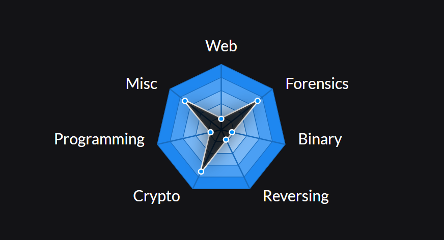
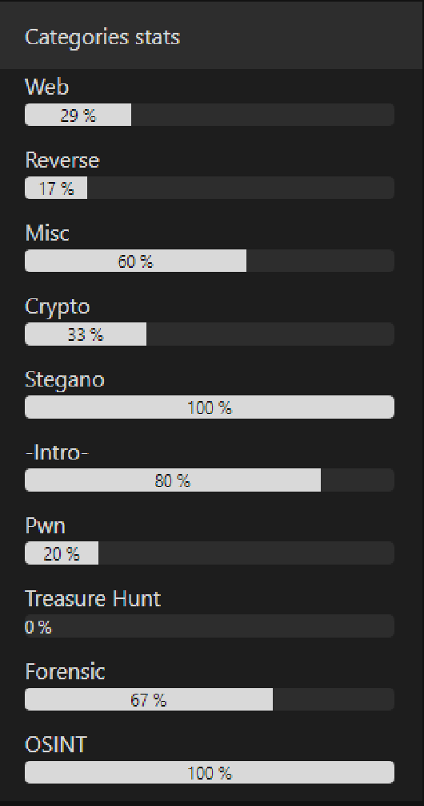
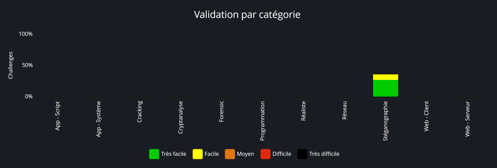

# - Solutions CTF

> __Note__
Certainly these are solutions but these remain mine. Trying to succeed on your own is more rewarding

- CTFLearn
  - [Forensic](https://github.com/GuillaumeDupuy/CTF/blob/main/CTFLearn/CTFLearn__forensic.md) . 
  - [Crypto](https://github.com/GuillaumeDupuy/CTF/blob/main/CTFLearn/CTFLearn__crypto.md) .
  - [Misc](https://github.com/GuillaumeDupuy/CTF/blob/main/CTFLearn/CTFLearn__misc.md) . 
  - [Programming](https://github.com/GuillaumeDupuy/CTF/blob/main/CTFLearn/CTFLearn__Prog.md) . 
  - [Web](https://github.com/GuillaumeDupuy/CTF/blob/main/CTFLearn/CTFLearn__web.md) . 
  - [Binary](https://github.com/GuillaumeDupuy/CTF/blob/main/CTFLearn/CTFLearn__binary.md) . 
  - [Reverse](https://github.com/GuillaumeDupuy/CTF/blob/main/CTFLearn/CTFLearn__reverse.md) . 

- 42CTF
  - [-Intro-](https://github.com/GuillaumeDupuy/CTF/blob/main/42CTF/42ctf__intro.md) . 
  - [Crypto](https://github.com/GuillaumeDupuy/CTF/blob/main/42CTF/42ctf__crypto.md) . 
  - [Forensic](https://github.com/GuillaumeDupuy/CTF/blob/main/42CTF/42ctf__forensic.md) . 
  - [Misc](https://github.com/GuillaumeDupuy/CTF/blob/main/42CTF/42ctf__misc.md) . 
  - [OSINT](https://github.com/GuillaumeDupuy/CTF/blob/main/42CTF/42ctf__osint.md) .
  - [Pwn](https://github.com/GuillaumeDupuy/CTF/blob/main/42CTF/42ctf__pwn.md) . 
  - [Reverse](https://github.com/GuillaumeDupuy/CTF/blob/main/42CTF/42ctf__reverse.md) .
  - [Stegano](https://github.com/GuillaumeDupuy/CTF/blob/main/42CTF/42ctf__stegano.md) . 
  - [Treasure Hunt]() Working in Progress .
  - [Web](https://github.com/GuillaumeDupuy/CTF/blob/main/42CTF/42ctf__web.md)

- RootMe
  - [Stegano](https://github.com/GuillaumeDupuy/CTF/blob/main/RootMe/RootMe__stegano.md) .

## Statistiques

- CTFLearn

<!--CTFLEARN-->
```text
🧑‍💻 Name: Varius93
📈 Number Points: 7390 
🥇 Ranking: 32
✅ Number of Challenges Finish: 143
```
<!--/CTFLEARN-->



- 42CTF

<!--42CTF-->
```text
🧑‍💻 Name: Varius
📈 Number Points: 310
🥇 Ranking: 51
✅ Number of Challenges Finish: 21
```
<!--/42CTF-->



- RootMe

<!--ROOTME-->
```text
🧑‍💻 Name: Varius
📈 Number Points: 325
🥇 Ranking: 36141
✅ Number of Challenges Finish: 17
```
<!--/ROOTME-->


