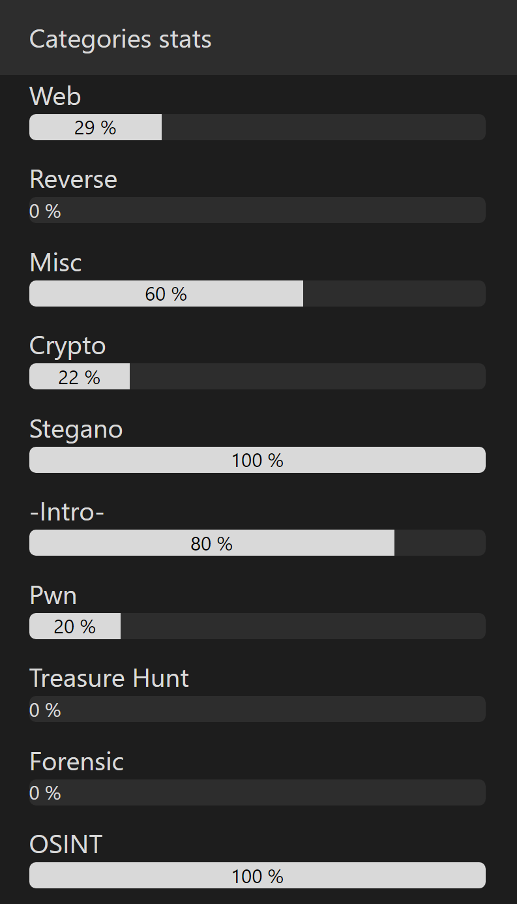

# - Solutions 42CTF

- 42CTF
  - [-Intro-](https://github.com/GuillaumeDupuy/42CTF/blob/main/42ctf__intro.md) . 
  - [Crypto](https://github.com/GuillaumeDupuy/42CTF/blob/main/42ctf__crypto.md) . 
  - [Forensic]() Working in Progress . 
  - [Misc](https://github.com/GuillaumeDupuy/42CTF/blob/main//42ctf__misc.md) . 
  - [OSINT](https://github.com/GuillaumeDupuy/42CTF/blob/main//42ctf__osint.md) .
  - [Pwn](https://github.com/GuillaumeDupuy/42CTF/blob/main//42ctf__pwn.md) . 
  - [Reverse]() Working in Progress .
  - [Stegano](https://github.com/GuillaumeDupuy/42CTF/blob/main/42ctf__stegano.md) . 
  - [Treasure Hunt]() Working in Progress .
  - [Web](https://github.com/GuillaumeDupuy/42CTF/blob/main/42ctf__web.md)

## Statistiques

