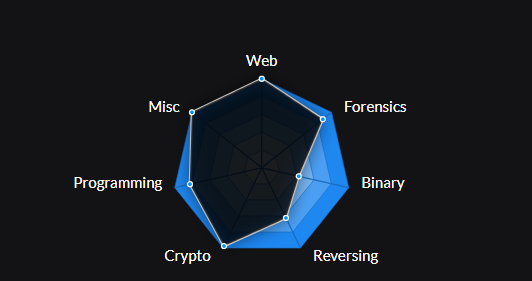
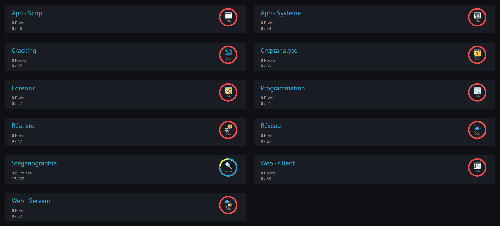

# - Solutions CTF

- CTFLearn
  - [Forensic](https://github.com/GuillaumeDupuy/CTF/blob/main/CTFLearn/CTFLearn__forensic.md) . 

- 42CTF
  - [-Intro-](https://github.com/GuillaumeDupuy/CTF/blob/main/42CTF/42ctf__intro.md) . 
  - [Crypto](https://github.com/GuillaumeDupuy/CTF/blob/main/42CTF/42ctf__crypto.md) . 
  - [Forensic](https://github.com/GuillaumeDupuy/CTF/blob/main/42CTF/42ctf__forensic.md) . 
  - [Misc](https://github.com/GuillaumeDupuy/CTF/blob/main/42CTF/42ctf__misc.md) . 
  - [OSINT](https://github.com/GuillaumeDupuy/CTF/blob/main/42CTF/42ctf__osint.md) .
  - [Pwn](https://github.com/GuillaumeDupuy/CTF/blob/main/42CTF/42ctf__pwn.md) . 
  - [Reverse](https://github.com/GuillaumeDupuy/CTF/blob/main/42CTF/42ctf__reverse.md) .
  - [Stegano](https://github.com/GuillaumeDupuy/CTF/blob/main/42CTF/42ctf__stegano.md) . 
  - [Treasure Hunt]() Working in Progress .
  - [Web](https://github.com/GuillaumeDupuy/CTF/blob/main/42CTF/42ctf__web.md)

- RootMe
  - [Stegano](https://github.com/GuillaumeDupuy/CTF/blob/main/RootMe/RootMe__stegano.md) .

## Statistiques

- CTFLearn

- 42CTF

- RootMe

<!--ROOTME-->
<!--/ROOTME-->