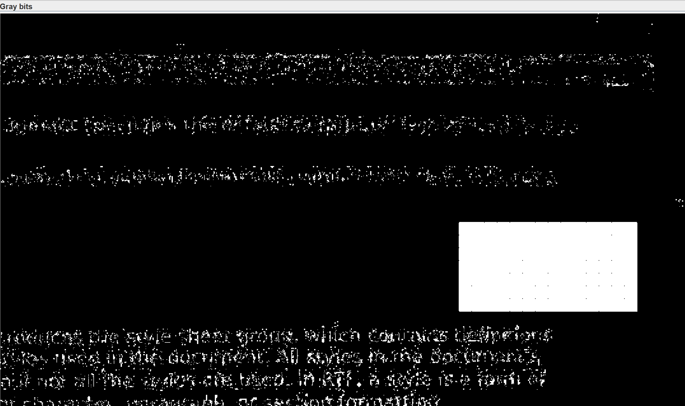
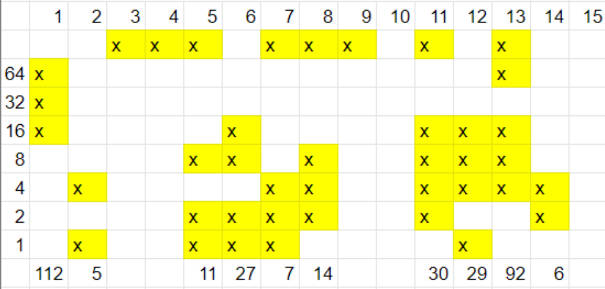

# EXIF - Metadata

`exiftool ` the file
And search the GPS Location on Google Maps

<details>
<summary markdown="span">Answer</summary>

flag :``
Marseille
``
</details>

# Point à la ligne

From the name of the challenge, we make two assumptions:

- Match characters under dot (dot and next line)

- And vice versa (next line and point)

<details>
<summary markdown="span">Answer</summary>

flag :``
chatelet15h
``
</details>

# Steganomobile

Use [Dcode](https://www.dcode.fr/code-multitap-abc) for decoding 

<details>
<summary markdown="span">Answer</summary>

flag :``
cellphone
``
</details>

# Twitter Secret Messages

Use [Twitter Secret Messages](https://holloway.nz/steg/) for decoding

<details>
<summary markdown="span">Answer</summary>

flag :``
grand central terminal
``
</details>

# TXT - George et Alfred

When reading Alfred de Musset's answer, we notice a hint, which is to read the first word of each sentence. So we see that Alfred is addressing a question to George Sand, we use the same method and we find the flag

<details>
<summary markdown="span">Answer</summary>

flag :``
Cette Nuit
``
</details>

# WAV - Analyse de bruit

Use the Audicity tool to modify the sound. After much testing, the formula for an English voiceover is: Speed ​​Low (reduced to 30%) + Reverse (reverse audio track)

<details>
<summary markdown="span">Answer</summary>

flag :``
3b27641fc5h0
``
</details>

# Poem from Space

Use the Whitespace Language decoding tool to decode on site [Dcode](https://www.dcode.fr/langage-whitespace)

<details>
<summary markdown="span">Answer</summary>

flag : ``
RootMe{Wh1t3_Sp4c3}
``
</details>

# Points jaunes

Use stegsolve, open the image, swicth in **Gray Bits**, you have a white square. Is the serial number of the scanner.



Make a table of each points of the image according to the bits and you will find the flag



Or use [Docucolor Decoder](https://wiki.tcl-lang.org/page/Docucolor+yellow+tracking+dots+decoder) in TCL language

<details>
<summary markdown="span">Answer</summary>

flag :``
11:05 27/07/2014 06922930
``
</details>

# EXIF - Miniature

We notice with binwalk that there is another image. So we'll extract it with the command

```sh
dd bs=1 skip=404 if=ch10.jpg of=ch10_extract.jpg
```

Otherwise, we extract the image twice with exif

```sh
exif -e ch10.jpg
exif -e ch10.jpg.modified.jpeg
```

<details>
<summary markdown="span">Answer</summary>

flag :``
B33r1sG00d!
``
</details>

# WAV - Analyse spectrale

Use Audacity and select spectogramme 

<details>
<summary markdown="span">Answer</summary>

flag :``
secret-password
``
</details>

# APNG - Just A PNG

You can use the [APNG Disassembler](https://sourceforge.net/projects/apngdis/) to recover the images and the timers of each image. And you are using the first python script [python scripts](https://github.com/GuillaumeDupuy/CTF/blob/main/RootMe/scripts/ascii.py)

If you don't want to install an application then use the second script commented out [python scripts](https://github.com/GuillaumeDupuy/CTF/blob/main/RootMe/scripts/ascii.py)

<details>
<summary markdown="span">Answer</summary>

flag :``
P3PoFRoG
``
</details>

# Crypt-art

Use `strings` to discover the text encrypted.

We must already find the key that was used to encode the text, we use [BertNase's Own](http://www.bertnase.de/npiet/npiet-execute.php). Once the key is discovered, we can decode the text on the site [Cryptii](https://cryptii.com/) and we paste our text, we select "Vigénère Cipher" and we copy our key

<details>
<summary markdown="span">Answer</summary>

flag :``
ARTLOVERSWILLNEVERDIE
``
</details>

# PDF - Embedded

We use the pdf-parser tool, we notice a hidden file at reference 77, we will extract it with the command :

``python
pdf-parser.py -o 77 -f -d Hidden_b33rs.txt epreuve_BAC_2004.pdf
``

When extracted, we notice that the file contains ASCII text that looks like base64. We will convert the file and recover the image with the command :

``
base64 -d Hidden_b33rs.txt > Hidden.png
``

<details>
<summary markdown="span">Answer</summary>

flag :``
Hidden_embedded_Fil3
``
</details>

# Kitty spy

The first step is unzip the jpg image. 

```sh
unzip ch16.jpg
```

For the step 1, use [Stegonline](https://stegonline.georgeom.net/upload) or Stegsolve for discover text encoded

Password step2 : ``
f1rstStepi5DoN3
``

At the end of README#2, you see a hex string can be unhashed using the tool at [Hashes](https://hashes.com/en/decrypt/hash). And you discover a string, is the extract password of monster.waw

```sh
steghide extract -sf monster.wav -p meowmeowmeowmeow
```

A txt file is extract, cat the file and you see the password of step3

Password step3 : ``
s3c0nDSt3pIsAls0D0n3
``

On the third step, you have so many informations :

- On the LICENSE.md you can find a brainfuck can be decoded using the tool at [Dcode](https://www.dcode.fr/langage-brainfuck)
- On the index.html, you have the hint : ``You just have to know that the hidden message is not using numbers ! You have to skip them :) ``
and ``"Do you know the difference between a "C" and a "c" ? ... It could help you !"``
- And the README file : ``QRCode - It's very funny to hide a QRCode in a picture ... you just have to apply 1-LSB on a pixel color to hide it ...``

So in the index.html, we find suspicious html tags throughout the site and we remember the uppercase and lowercase index. So let's go recover all html tags. Use [python scripts](https://github.com/GuillaumeDupuy/CTF/blob/main/RootMe/scripts/htmltags.py) for recover password

Password step3 : ``
n3xTSt3pIsTh3L4st
``

Now is the last step of the challenge. It's easier than the last part, you just need to LSB the image and find each LSB plane has a QR Code. We can decode online at [4qrcode](https://4qrcode.com/scan-qr-code.php)

<details>
<summary markdown="span">Answer</summary>

flag : ``
C4tsW1llRul3th3W0rld
``
</details>

# PNG - Pixel Indicator Technique

Use [Stegopit](https://gist.github.com/dhondta/30abb35bb8ee86109d17437b11a1477a) for discover the flag. 

<details>
<summary markdown="span">Answer</summary>

flag :``
PiTiSAls0aSteg4n0gr4ph1eM3thod
``
</details>

# PNG - Pixel Value Differencing

Use [Stegopvd](https://gist.github.com/dhondta/feaf4f5fb3ed8d1eb7515abe8cde4880) for discover the flag. 

<details>
<summary markdown="span">Answer</summary>

flag :``
PvD:Pl4tiNuMvSDi4m0nd
``
</details>

# Base Jumper

If you use exiftool, we see excessive comments, so this can be exported to a text file

```sh
exiftool ch15.jpg > ch15.txt
```

This shows the comments are base64 encoded copy of RFC 3548. The bits can be extracted to base32 using unhide_bits function. When decoded, this provides a wikipedia page on base jumping. Extracting again, the ascii flag can be found. Use [python scripts](https://github.com/GuillaumeDupuy/CTF/blob/main/RootMe/scripts/base32.py) for recover flag

<details>
<summary markdown="span">Answer</summary>

flag :``
3v3ry0ne_h4s_s3cr3ts!
``
</details>

# Mimic - Dummy sight

In progress

# ELF x64 Duality

In progress

# PNG - Least Significant Bit

In progress

# Angecryption

In progress

# Hide and seek

In progress

